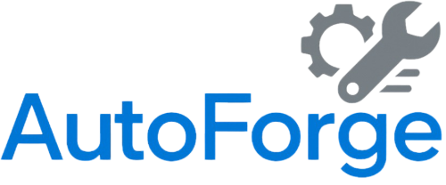
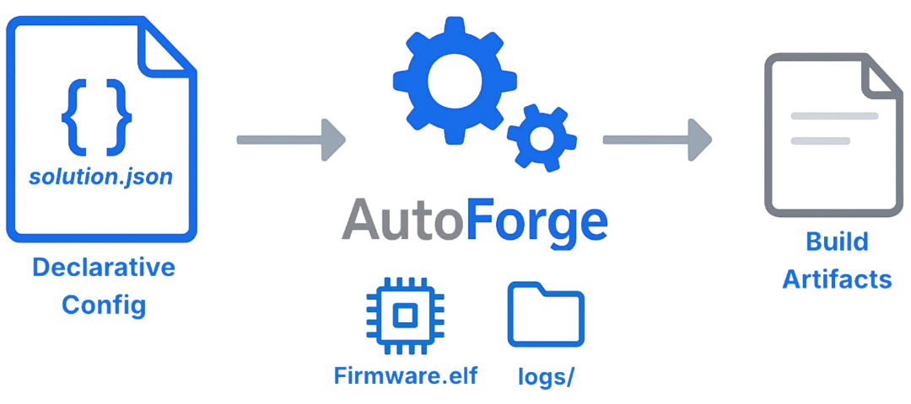
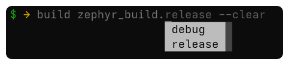

<!--suppress HtmlDeprecatedAttribute -->
<br>
<div align="center">
  
</div>
<br>

**AutoForge** is an extensible, Python-based framework designed to streamline complex build and validation workflows
across embedded and software systems. Built with automation, clarity, and scalability in mind,
it enables developers to define, run, and manage sophisticated build pipelines with minimal
friction and maximum control.

### In A Nutshell

<div align="center">
  
</div>

At its core, **AutoForge** transforms JSON-based declarative definitions into fully automated build flows.
It handles everything from environment setup and configuration validation to build orchestration,
structured logging, error recovery, and post-build analytics.
Whether you're compiling a single RTOS image or coordinating cross-platform
tool-chains, this tool offers a unified interface to get the job done efficiently.

### Key Features

- **Declarative Build Recipes**  
  Define and reuse build flows using structured, human-readable JSONC files with support for dynamic variable
  resolution and dependency injection.

- **Modular CLI Framework**  
  Add and extend functionality via self-registering Python modules that conform to a common `CLICommandInterface`. The
  system includes a user-friendly interactive shell with support for tab-completion, history-based suggestions, and
  contextual
  help. <br><br><br>

- **Integrated Help System**  
  Discover commands, arguments, and usage examples via a built-in help interface accessible from the terminal without
  leaving your workflow.

- **Robust Logging and Telemetry**  
  Structured, colorized logs and build-time telemetry for auditability and debugging across local and CI environments.

- **Environment Virtualization & Probing**  
  Automated setup and tear-down of environment variables, tool-chains, and paths including native detection of SDKs,
  tool
  versions, and platform capabilities.

- **Plugin-Based Extensibility**  
  Dynamically discoverable plugins let teams introduce new command types, validators, and tool integrations without
  altering the core.

### AI-Friendly by Design

<br>
<div align="center">
  
</div>
<br>

**AutoForge's** predictable structure, rich metadata, and standardized error handling make it ideal for AI-assisted
development **and debugging. Its JSON-based configuration, uniform logging,
and consistent directory layout allow AI tools to:

- Understand project state quickly
- Locate build artifacts and failures reliably
- Offer actionable suggestions with minimal context

This makes this tool particularly suitable for advanced workflows involving intelligent
assistants and automated analysis tools.

---

## Getting Started in Bare Solution Mode

While **AutoForge** is primarily designed for managing and building projects via a well-defined **solution file**, it
can also be executed in a special _bare solution mode_.  
In this mode, AutoForge loads a minimal internal (crippled) solution that doesn't allow building—but it **does** enable
you to explore and run many of its commands. Think of it as a way to **test-drive the framework at your own pace**.

This is particularly useful for:

- Experimenting with available commands
- Exploring the CLI features
- Understanding the workspace lifecycle
- Trying out logging, configuration, and diagnostic tools

---

### Setup Instructions (Linux: Fedora, Ubuntu, or WSL)

> 💡 **Pre-requisites**
> - Make sure your development environment was previously initialized using `dt` (your org’s dev-tools setup).
> - You must have access to the Intel [intel-innersource](https://github.com/intel-innersource) GitHub server.

> ℹ️ If you are behind a proxy, make sure your `http_proxy` and `https_proxy` environment variables are configured
> correctly.
---

#### Step 1: Ensure Python Version

AutoForge requires **Python 3.9 to 3.12**, inclusive.

Check your version:

```bash
python3 --version
```

#### Step 2: Create a Virtual Environment

This isolates AutoForge from other Python packages on your system:

```bash
python3 -m venv .venv
```

#### Step 3: Activate the Virtual Environment

```bash
source .venv/bin/activate
```

#### Step 4: Upgrade Pip

```bash
pip install --upgrade pip
```

#### Step 5: Install AutoForge from Git

```bash
pip install git+https://github.com/intel-innersource/firmware.ethernet.devops.auto_forge.git
```

#### Step 6: Run AutoForge in Bare Solution Mode

```bash
autoforge --bare
```

---

## The 'userspace' Demo Project

For detailed instructions and structure, refer
to: [The Userspace Demo Project](https://github.com/intel-innersource/firmware.ethernet.devops.auto_forge/tree/main/src/auto_forge/resources/samples/userspace/README.md)

## Additional Resources

- **Package Details:**  
  [About AutoForge](https://github.com/intel-innersource/firmware.ethernet.devops.auto_forge/blob/main/src/auto_forge/resources/help/package/about.md)

- **SDK Integration Roadmap – Modular Breakdown:**  
  [Intel Wiki](https://wiki.ith.intel.com/x/1Jp98w)

<div style="text-align: center;">
  
</div>

Got ideas or improvements?<br>Jump in and help make **AutoForge** even better - contributions are always welcome!

## License

This project is licensed under the MIT License—see the LICENSE file for details.
