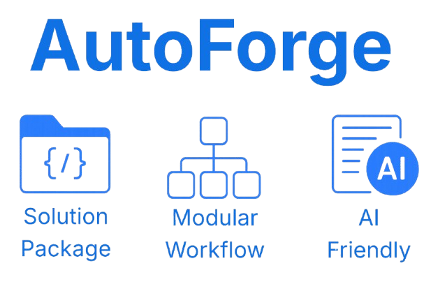

<!--suppress HtmlDeprecatedAttribute -->
 

  

 

# About

**AutoForge** is a modular build and automation framework designed to orchestrate complex software environments in a consistent, reproducible, and extensible way.

It is **not** bound to any specific build system, toolchain, or technology stack. Instead, AutoForge operates through a **solution package** — a set of structured JSON files that define projects, configurations, commands, tools, environments, and automation sequences.

By interpreting the solution package, AutoForge can:
- Create isolated development or CI-ready workspaces
- Trigger builds using user-defined aliases
- Execute post-processing tools and log analyzers
- Interface with AI agents and CI/CD systems via machine-readable exports

At its core, AutoForge provides a clean separation between **logic (AutoForge engine)** and **project intent (solution package)**, making it ideal for teams working across diverse platforms and toolchains.

---

## The Solution Package

### 1. The Solution File

At the heart of AutoForge is the **solution package**, which includes the main `solution.json` as well as several optional companion JSON files. These files use a custom *augmented JSON syntax* to describe:

- The **solution** itself  
- Its derived **projects**  
- Each project may include one or more **configurations**  

Each configuration defines a single build output:

- Toolchain  
- Paths  
- Specific variables  
- Pre-/post-build steps  
- Help documents  
- A **command alias** (e.g., `build_sample`), which serves as a trigger for invoking this build.

> Example: `build_ssample` could refer to a CMake + Ninja build at a specific path, using unique flags and steps — all defined under a named configuration.

---

### 2. The Sequence File

A solution package can define a special JSON file titled `sequence.json`, which includes a list of batch operations that AutoForge can execute.

While not specific to workspace creation, this ability to follow versatile, ordered instructions is instrumental in creating a fresh solution workspace.

---

## Execution Modes

The package is constructed so that it can handle several different flows. All share the following common attributes:

- They are triggered by a unique combination of arguments to the AutoForge package.  
- The **solution package** defines everything related to a specific solution and is required for all subsequent operations.  
- All flows make use of AutoForge's infrastructure modules, including logging, telemetry, environment management, and more.

### 1. Workspace Initialization (via Sequence)

AutoForge can create a solution-specific workspace based on a sequence file (e.g., `sequence.json`). This may include:

- Verifying tool availability  
- Creating a Python virtual environment  
- Cloning sources  
- Downloading toolchains  
- Executing external commands  
- Invoking methods from the AutoForge SDK  

These operations are available via the `platform` SDK class.

---

### 2. User-Interactive Build Shell

This mode launches an interactive shell for development and debugging. It allows the developer to execute any of the build configurations defined in the solution.

This shell is based on `cmd2` + `prompt_toolkit` and includes:

- Autocompletion  
- Hints  
- History  
- Integrated Markdown and JSON viewers using `textual`

---

### 3. Automatic Mode

This mode is designed for **CI/CD tools or AI agents**. The caller specifies a recognized command alias (like `build_ssample`), and AutoForge:

- Processes the solution  
- Locates the matching command  
- Executes it  
- Returns the exit status

---

### 4. AI – Export Package Context File

AutoForge can generate an **AI-friendly JSON summary** that includes:

- Workspace layout  
- Available commands and aliases  
- Paths and variables  
- Help/documentation references  
- Build artifacts  
- Suggested commands  
- Build error summaries for AI consumption  

This allows an AI agent to understand, manipulate, and reason about the solution environment.

---

## Extensibility

### 1. Commands

AutoForge allows dynamically adding:

- Commands  
- Help files  
- Paths  
- Context creators  
- Builders  
- Log analyzers  

All are governed by specific abstract classes to ensure proper integration.

---

### 2. The SDK

AutoForge exposes an SDK — a public set of Python classes providing access to:

- Core modules  
- AI bridge  
- Logging  
- Platform monitoring  
- Telemetry  
- And more

---

## 🧩 Runtime Dependencies

| Package             | Description                                                                                  | License (Model)    |
|---------------------|----------------------------------------------------------------------------------------------|--------------------|
| `packaging`         | Parse and compare package versions and requirements.                                         | Apache License 2.0 |
| `wheel`             | Build standard Python wheel distribution packages.                                           | MIT                |
| `opentelemetry-api` | Core telemetry API for tracing and metrics instrumentation.                                  | Apache License 2.0 |
| `opentelemetry-sdk` | SDK implementation for OpenTelemetry API (exporters, processors).                            | Apache License 2.0 |
| `colorama`          | Cross-platform colored terminal text (Windows ANSI compatibility).                           | BSD 3-Clause       |
| `rich`              | Modern terminal formatting library for text, tables, trees, progress bars, etc.              | MIT                |
| `tabulate`          | Pretty-print tabular data in various formats (plain, HTML, grid, etc.).                      | MIT                |
| `pyfiglet`          | Render text as ASCII art using FIGlet fonts.                                                 | MIT                |
| `psutil`            | Access system and process info (CPU, memory, disks, network).                                | BSD 3-Clause       |
| `toml`              | Parser for TOML configuration files.                                                         | MIT                |
| `gitpython`         | Git repository access and automation via Python interface.                                   | BSD 3-Clause       |
| `jsonpath-ng`       | Extract values from nested JSON structures using JSONPath expressions.                       | Apache License 2.0 |
| `json5`             | Parser for relaxed JSON (comments, trailing commas, etc.).                                   | MIT                |
| `jsonschema`        | Validate JSON data structures against defined schemas (Draft 4+).                            | MIT                |
| `pyaml`             | Thin wrapper around PyYAML for cleaner YAML serialization.                                   | MIT                |
| `ruamel.yaml`       | YAML parser/emitter that preserves comments and formatting.                                  | MIT                |
| `prompt_toolkit`    | Powerful interactive command-line interface (CLI) toolkit.                                   | BSD 3-Clause       |
| `jmespath`          | Query language for filtering JSON data (used by AWS tools).                                  | MIT                |
| `textual`           | Terminal UI framework for building rich text user interfaces with layout, mouse, async, etc. | MIT                |
| `whoosh`            | Pure-Python search engine library for indexing and querying text.                            | BSD                |
| `watchdog`          | Monitor filesystem changes across platforms (used in hot reload, file triggers).             | Apache License 2.0 |
| `pynput`            | Control and monitor keyboard/mouse input, used for productivity tracking.                    | GPLv3 (copyleft)   |
| `cmd2`              | Enhances standard cmd module with features like auto-completion, history, and scripting.     | MIT                |

---

Got ideas or improvements? Jump in and help make **AutoForge** even better - contributions are always welcome!

## License

This project is licensed under the MIT License—see the LICENSE file for details.
